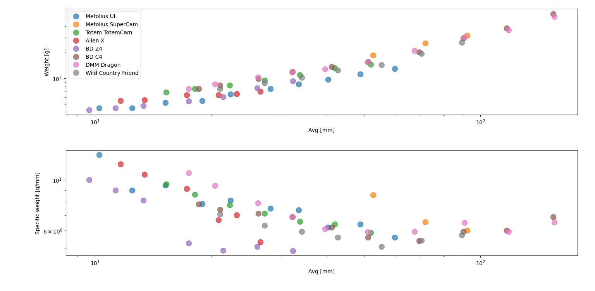

# Climbing cams

Just for fun. This small repo contains a set of tools for graphic visualization of the properties of climbing cams or *friends*.
This tool is intended to show quantitative static properties, such as the expansion rate or weight. Other properties are not static, such as price. Hence, it is not included in this repo. Finally, but not least important, there are qualitative properties, such as walking and personal feeling, which are not included in this repo.

A little bit of history. *Friends* where invented by [Ray Jardine](https://www.rayjardine.com/Home/index.php), an aerospace engineer. After several years of development, Ray joined with Mark Valance, who founded Wild Country and commercialized the first *Friends*. Nowadays, the original patents have expired and the climbing cams are now an open market.

## Some examples

Several cams are pre-loaded in the database, these are the available brands:
- Black Diamond C4
- Black Diamond UL
- Black Diamond Z4
- Metolius UL
- Metolius Super cam
- Totem Cam
- DMM Dragon
- Wild Country Friend
- Rock Empire Axel
- LACD Twin
- Alien X

The figure below shows a typical bar chart for racks comparison. Selection of cams can be done by the user 

Scatter plots can be done showing the average of a family or plotting individually every cam. Family plots are more compacts and easier to read. Expansion rate and specific weight is an interesting properties and its average values are plotted below. Surprisingly, Wild Countri Friends are extremely light according to this comparison.

For a bette rvisualization, logarithmic scales have been used.

Cams can be plotted individually. The absolute weight is also important, not only the specific weight. When looking at individual cams, it can be seen that Metolius UL strategy is to have multiple and extremely light cams, so you can carry more cams in your harness while keeping the same weight.

When the same plot is repeated for specific weights, the slope of the _thick line_ is the opposite. DMM Dragon are very similar to Black Diamond UL, and Black Diamond Z4 excel at small sizes.
