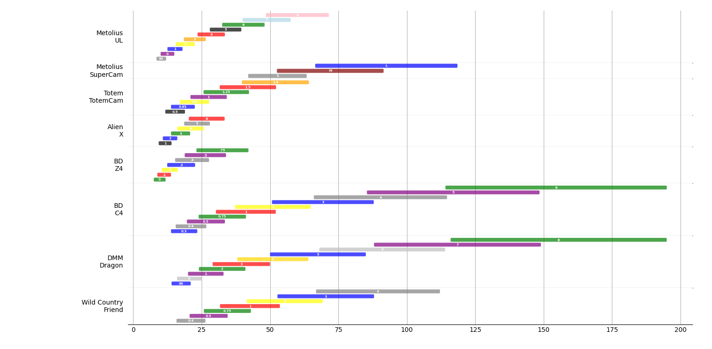
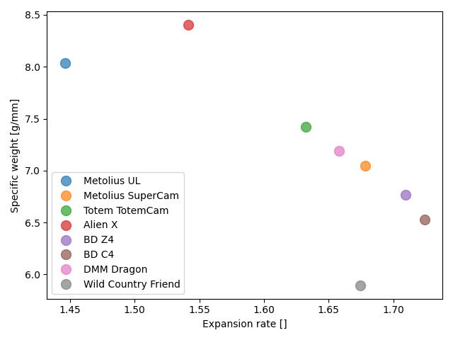

# Climbing cams

Just for fun. This small repo contains a set of tools for graphic visualization of the properties of climbing cams or *friends*.
This tool is intended to show quantitative static properties, such as the expansion rate or weight. Other properties are not static, such as price. Hence, it is not included in this repo. Finally, but not least important, there are qualitative properties, such as walking and personal feeling, which are not included in this repo.

A little bit of history. *Friends* where invented by [Ray Jardine](https://www.rayjardine.com/Home/index.php), an aerospace engineer. After several years of development, Ray joined with Mark Valance, who founded Wild Country and commercialized the first *Friends*. Currently, the original patents have expired and it's now an open market.

## Some examples

